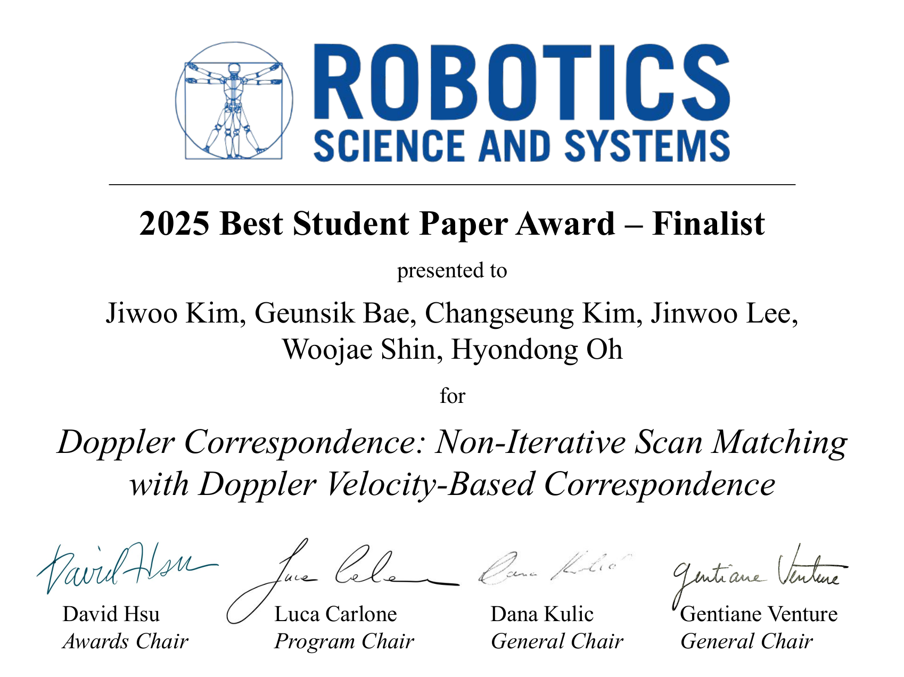
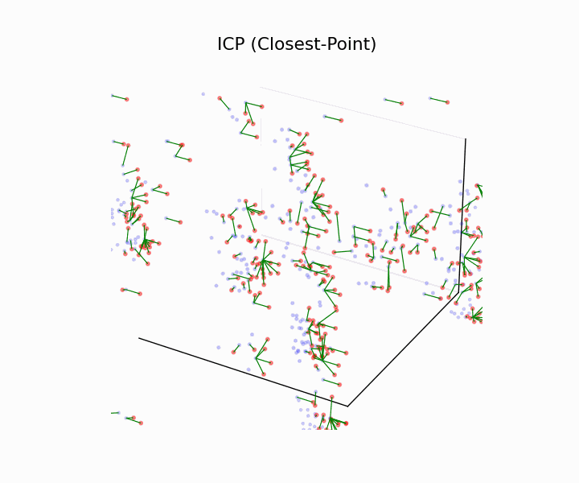
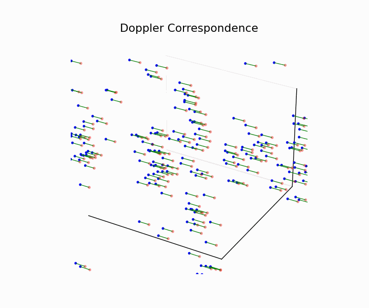
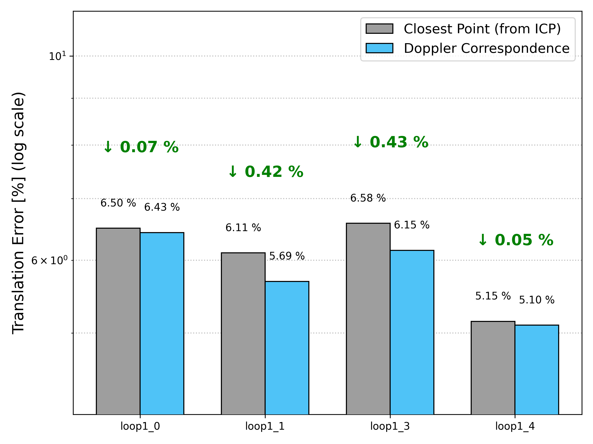

# Doppler Correspondence

📌 **Presented at**: [Robotics: Science and Systems (RSS) 2025](https://roboticsconference.org/program/papers/5/)  
🏆 **Outstanding Student Paper Award Finalist – RSS 2025**  
> A correspondence estimation method that leverages **Doppler information** for local registration in 4D ranging sensors.

<p align="center">
  
</p>

---

## Resources  
- 📄 **[Paper PDF](https://roboticsconference.org/program/papers/5/)**
  - Doppler Correspondence: Non-Iterative Scan Matching With Doppler Velocity Based Correspondence, Jiwoo Kim, Geunsik Bae, Changseung Kim, Jiwoo Lee, Woojae Shin, Hyondong Oh, [RSS] 2025.
- 🎬 **[Presentation Video](https://roboticsconference.org/program/papers/5/)**
<p align="center">
  <a href="https://www.youtube.com/watch?v=i0g5dpq_cSQ" target="_blank">
    
  </a>
</p>

---

## 4D Radar Scan Matching With Doppler Correspondence

### 🍎 Tutorial (Python) 

Brief overview of how Doppler Correspondence works and how it differs from closest-point correspondence from ICP.
An demo is available in the following folder: 📂 `example/example.ipynb`

#### Table of Contents

- **Closest-Point Correspondence**  

- **Doppler Correspondence**

- **ICP vs. Doppler Correspondence (non-iterative)**  

- **Doppler Correspondence + RANSAC**
  
- **Odometry Example With ICP, Doppler Corr, Doppler Corr + RANSAC**

### 🍎 Closest Point Correspondence vs Doppler Correspondence

> Visualization ICP correspondence and Doppler Correspondence:

#### 3D Zoom
<div style="display:flex; justify-content:center; gap:24px;">
  
  
</div>


#### Error Comparsion 

<p align="center">
  
</p>

This figure shows the translation error distribution of both methods evaluated on the **Loop1 sequences** from the [NTU4DRadLM dataset](https://github.com/junzhang2016/NTU4DRadLM).  
You can choose the correspondence strategy via the `lambda_doppler` parameter in `config/config.yaml`:
- `lambda_doppler: 0.0` → **Pure Closest Point (ICP)**  
- `lambda_doppler: 1.0` → **Full Doppler Correspondence**  
- `lambda_doppler` between `0.0 ~ 1.0` → **Hybrid approach**, which often yields the best results by balancing geometric and Doppler cues.

### 🍎 Usage
#### Dependencies

This package requires the following dependencies:
- **Eigen3 ≥ 3.3**
- **PCL** (Point Cloud Library)
- **ROS** (Noetic)
     
We have tested this package on Ubuntu 20.04 and Intel(R) Core(TM) i7-14700KF.

#### ROS (C++)

```bash
# Clone the repository inside your catkin workspace
cd ~/catkin_ws
mkdir -p src && cd src
git clone https://github.com/Tars0523/Doppler_Correspondence.git
# Build the workspace
cd ~/catkin_ws
catkin build
# Source the environment
source devel/setup.bash
# Launch the node with RViz
roslaunch Doppler_Correspondence run.launch
```
---

## 🙏 Acknowledgements

**Autonomous Systems Laboratory (ASL), UNIST**  – <https://asl.unist.ac.kr/>
We are deeply grateful to everyone in the [Autonomous Systems Laboratory](https://asl.unist.ac.kr/) for their feedback, code reviews, and countless discussions that shaped this work. In particular, we would like to thank:

| Name | GitHub · Contact | Research Interest |
|------|------------------|------|
| 🔥 **Geunsik Bae** | [@9iant](https://github.com/9iant) · baegs94@unist.ac.kr | Ph.D. Student — Path Planning, Ergodic Search |
| 🔥 **Jinwoo Lee** | [@jinwoolee1230](https://github.com/jinwoolee1230) · jinwoolee2021@unist.ac.kr | M.S. Student — Path Planning, PCR |
| ✨ **Changseung Kim** | [@spearwin](https://github.com/spearwin) · pon02124@unist.ac.kr | Ph.D. Student — LiDAR SLAM |
| ✨ **Wooaje Shin** | [@sindream](https://github.com/sindream) · oj7987@unist.ac.kr | M.S. Student — Reinforcement Learning, Vision-Based Navigation |
| *(All Other ASL members\!)* | — | — |

**Legend**  
- 🔥 Idea & Implementation  
- ✨ Advisory Support  
---

### 📊 Dataset

Experiments in this repository are conducted using the **NTU4DRadLM** 4-D Radar-centric Multi-Modal Dataset.  
Many thanks to Jun Zhang *et al.* for releasing this challenging dataset to the community!  
<https://github.com/junzhang2016/NTU4DRadLM>


